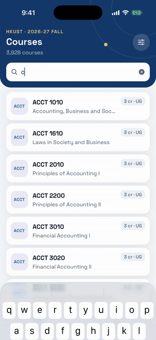
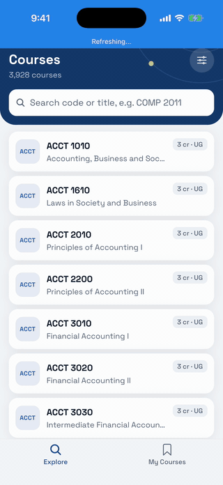
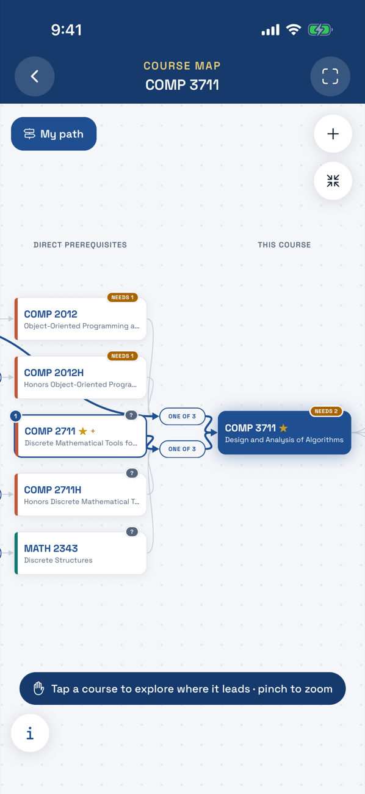
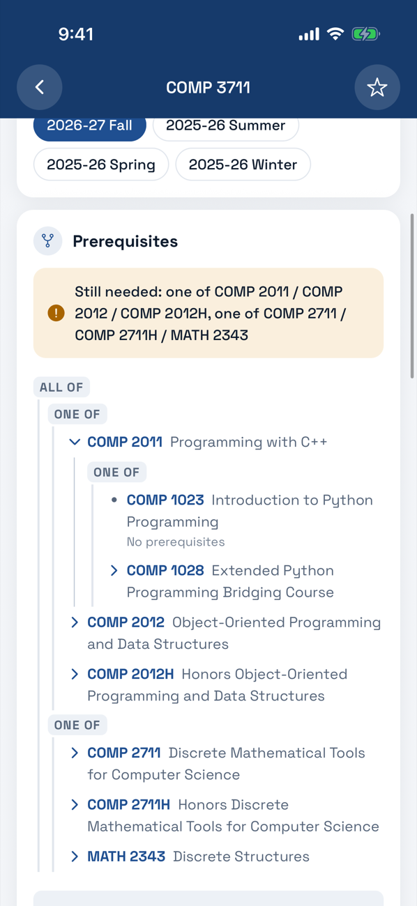
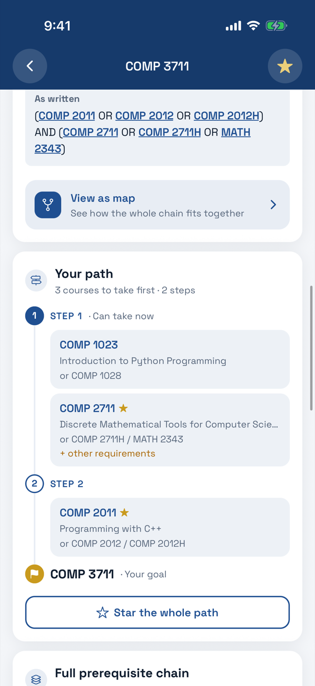
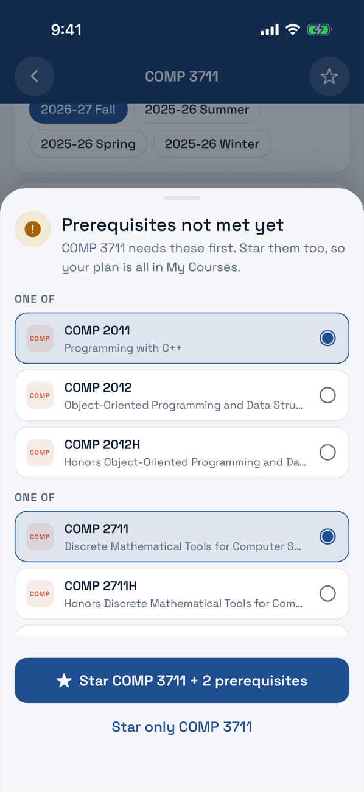
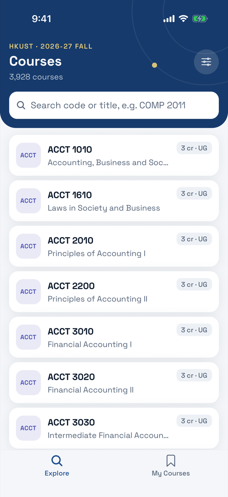
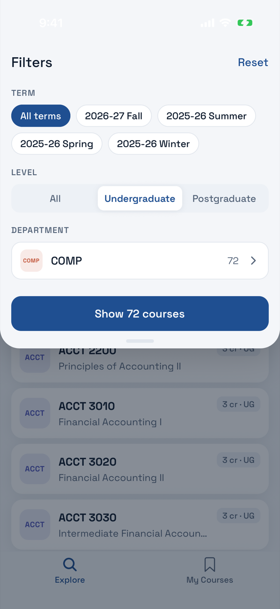
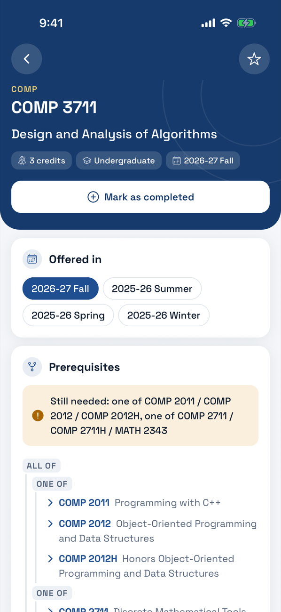
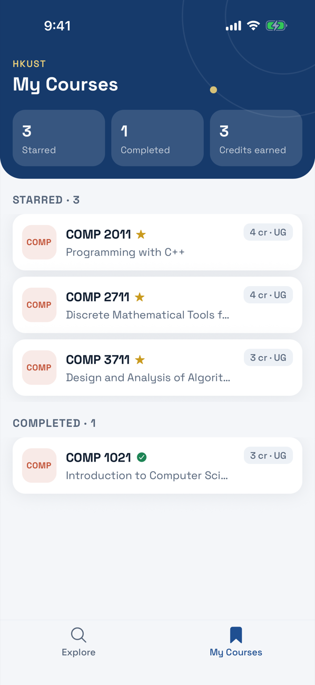

# UST GradPath

**Plan your route through HKUST courses.**

[](https://github.com/BhanuRana/ust-gradpath/actions/workflows/ci.yml)

HKUST publishes prerequisites as free text, such as _"(COMP 2011 OR COMP 2012) AND grade B or above in MATH 2111"_. Working out what that means, what it leads to, and how far you are from a course takes a lot of cross-referencing. GradPath turns the whole catalogue into a prerequisite graph you can explore: search 4,030 courses, see each one's chain as a tree or an interactive map, mark what you've completed, and it tells you what you can take now and the shortest route to what you can't.

It runs fully offline on iOS and Android. React Native, Expo, TypeScript.

<table>
  <tr>
    <td align="center"></td>
    <td align="center"></td>
    <td align="center"></td>
  </tr>
  <tr>
    <td align="center"><b>The course map</b></td>
    <td align="center"><b>Browse and search</b></td>
    <td align="center"><b>Plan your route</b></td>
  </tr>
</table>

<table>
  <tr>
    <td>
      <b>Try it on Android:</b> <a href="https://github.com/BhanuRana/ust-gradpath/releases/latest/download/UST-GradPath.apk">download the APK</a> (46 MB), or scan the code with your phone.<br/>
      It's a signed release build from outside the Play Store, so Android asks you to allow installs from your browser.<br/><br/>
      <b>iPhone:</b> build from source (<a href="#run-it">Run it</a>).
    </td>
    <td align="center"></td>
  </tr>
</table>

## What it does

**The course map.** A pan-and-zoom graph of everything a course needs (left) and everything it leads to (right).

- Arrows show what feeds what; "one of" groups meet at junctions (`ONE OF 3`); prerequisite loops are dashed.
- Tap a course to light up everything it needs and feeds. A card says where it sits ("Direct prerequisite of COMP 3711"), whether you can take it, and what it's about.
- Tap a course on the "leads to" side to open what _it_ leads to, one branch at a time, with a breadcrumb back.
- Once you've marked courses completed, each one is tagged **CAN TAKE** or **NEEDS 2**, and requirements you've met turn green.

**What can I take?** Mark the courses you've passed:

- Every course page says whether you meet its prerequisites, and exactly what's missing: _"Still needed: one of COMP 2711 / COMP 2711H / MATH 2343"_.
- **Unlocked for me** filters the catalogue to courses you can take right now.
- Marking a course completed asks which of its prerequisites you've done too, so entering your history takes a few taps.

**Your path.** For any course, the steps to get there from what you've done: step 1 is what you can take now, and the number of steps is the fewest terms it can take. Each step shows the seasons a course runs in and the alternatives it stands for. Starring a course you can't take yet offers to star its prerequisites, so the whole plan lands in **My Courses**.

**Browse and search.** 4,030 courses across 4 terms and 129 departments. Search matches codes and titles in any spacing, case or word order (`comp2`, `COMP 2011` and `systems operating` all work), with matches highlighted. Filter by term, level and department, with a live count before you apply.

**Course pages.** Prerequisites as an expandable AND/OR tree you can follow course by course, the full chain by level, what the course leads to, per-term details, and the original text with every course code linked.

<table>
  <tr>
    <td></td>
    <td></td>
    <td></td>
    <td></td>
  </tr>
  <tr>
    <td></td>
    <td></td>
    <td></td>
    <td></td>
  </tr>
</table>

## Tech stack

|                        |                                                                                        |
| ---------------------- | -------------------------------------------------------------------------------------- |
| App                    | React Native 0.83 (New Architecture), Expo SDK 55, TypeScript (strict), React Compiler |
| Navigation             | Expo Router: file-based routes in `src/app/`                                           |
| Gestures and animation | React Native Gesture Handler, Reanimated 4                                             |
| Graphics               | react-native-svg (map edges, illustrations)                                            |
| Storage                | MMKV v4: synchronous, on-device                                                        |
| Testing                | Jest (69 unit tests), Maestro (7 end-to-end flows on iOS and Android)                  |
| CI                     | GitHub Actions: typecheck, lint, format, unit tests                                    |

## Architecture

```mermaid
flowchart LR
  raw["courses.json<br/>28 MB · 15,178 rows"] -- "npm run data" --> build["scripts/build-data.ts"]
  build --> index["index.json · 574 KB<br/>every course, for lists and search"]
  build --> graph["prereqs.json · 176 KB<br/>parsed trees + 'leads to' index"]
  build --> details["details/PREFIX.json × 129<br/>full records, one per department"]
  index & graph & details --> data["src/data<br/>catalog · parse · traverse<br/>evaluate · plan · map"]
  prefs[("MMKV<br/>stars · completed · term")] --> screens
  data --> screens["src/app<br/>Explore · Course · Map · My Courses"]
```

**Why this shape:**

- **Heavy work happens at build time.** The app never parses the 28 MB file. It loads a 574 KB index at startup, the 176 KB graph when you open a course, and one department's details (at most 457 KB) when you need them. Each distinct prerequisite string is parsed once, at build time.
- **The data layer is plain TypeScript with no React.** Parsing, traversal, eligibility, planning and map layout are pure functions. The build script, the app, the unit tests and the benchmark all use the same code, and the screens only call it.
- **State is small, so it lives in MMKV hooks.** Stars, completed courses and the chosen term are the only saved state. MMKV's hooks subscribe to their key, so every screen stays in sync with no context or state library.
- **Light theme only, as plain tokens.** Colours, spacing and type are constants used from `StyleSheet.create`, with no theme provider to re-render through.

```
src/
  app/                 routes: (tabs)/index (Explore), (tabs)/my-courses, course/[code], course/[code]/map
  components/
    ui/                text, button, chip, search field, sheet, empty state
    course/            course row, filter sheet, prerequisite tree, prompt, path timeline
    map/               nodes, card, key, controls, viewport (gestures), edge geometry
  data/
    catalog.ts         loading, search, filters, "unlocked for me"
    prereq/            parse → traverse → evaluate → plan → map
    generated/         build output (committed)
  hooks/               use-preferences (MMKV)
  theme/               colours, spacing, type, department colours
scripts/               build-data.ts, bench.ts, record-demo.sh
```

## How it works

**Parsing.** Prerequisites arrive as free text. A tokenizer and a small precedence parser turn each string into an AND/OR tree:

- `AND`/`OR` in any case, `()` and `[]` for grouping, and a spaced `/` meaning OR;
- commas take the operator of their segment, and OR binds tighter than AND;
- qualifiers attach to the course they describe, so nothing is silently dropped;
- anything that isn't a course code is kept as text.

```ts
parsePrerequisite("(COMP 2011 OR COMP 2012) AND grade B or above in MATH 2111")
// { kind: "all", children: [
//   { kind: "any", children: [{ kind: "course", code: "COMP 2011" }, { kind: "course", code: "COMP 2012" }] },
//   { kind: "course", code: "MATH 2111", note: "grade B or above in" } ] }
```

**Traversal without infinite loops.** The data has a real cycle: UCMP 6030 and UCMP 6040 require each other.

- **Tree:** it expands one level at a time. Each node carries its ancestor path, and a course already on that path shows as "↻ Loops back" instead of expanding. The same course on _different_ branches is fine.
- **Full chain:** a breadth-first walk with a visited set, listing each course once at its shallowest depth.
- **Map:** it keeps loop edges but marks them, so the layout ignores them.

**Eligibility.** Uses three-valued logic: a course is met if completed; free text (an HKDSE result, "MSc status") is _unknown_, not guessed; `all` needs every part and `any` needs one. When only free text is left, the course page says the course prerequisites are met and points you to the rest, rather than claiming you're eligible.

**Your path.** Picks one concrete route:

- A "one of" group takes your starred option first, then the option needing the fewest courses in total, then the first listed.
- Each course sits one step after its latest prerequisite, so step 1 is what you can take now.

**Map layout.** Courses go in columns: a course sits one column left of the leftmost course it's a prerequisite for, so every arrow points right. Groups meet at junctions half a column before the course they feed. Each node aims for the average height of the nodes it connects to, which keeps most edges straight. "Leads to" grows one branch at a time, because transitively it explodes: MATH 1020 reaches 295 courses in three steps.

## Module reference

The data layer's main functions, with real output from the dataset:

| Call                                               | Returns                                                                                      |
| -------------------------------------------------- | -------------------------------------------------------------------------------------------- |
| `searchCourses({ text: "comp37" })`                | `COMP 3711`, `COMP 3711H`, `COMP 3721`, … (exact code, then code prefix, then title matches) |
| `prereqTreeFor(graph, "COMP 3711")`                | the AND/OR tree for the chosen term, falling back to the newest version                      |
| `evaluate(tree, new Set(["COMP 2011"]))`           | `"unmet"` (or `"met"` / `"unknown"`)                                                         |
| `missingRequirements(tree, completed)`             | `["one of COMP 2711 / COMP 2711H / MATH 2343"]`                                              |
| `prerequisiteChain(graph, "COMP 3711")`            | `[{ code: "COMP 2011", depth: 1 }, …]`: 16 courses over 3 levels                             |
| `unlockedCourses(new Set(["COMP 2011"]))`          | a `Set` of the 16 courses you can now take                                                   |
| `planPath(graph, "DSAA 3072", completed, starred)` | `steps: [["UFUG 1601"], ["UFUG 2106"], ["DSAA 3071"]]`                                       |
| `buildCourseMap(graph, "COMP 3711")`               | 28 nodes, 35 edges, in columns −4 … +1                                                       |

## Performance

`npm run bench`, median, on Node (a phone running Hermes is slower in absolute terms; the orders of magnitude are the point):

| Operation                                                | Time    |
| -------------------------------------------------------- | ------- |
| Parse the raw 28 MB `courses.json` (what the app avoids) | 48 ms   |
| Parse the startup index                                  | 1.6 ms  |
| Search "operating systems" across 4,030 courses          | 0.36 ms |
| "Unlocked for me" (evaluates every course)               | 0.25 ms |
| "Your path" to the largest target                        | 0.03 ms |
| Lay out the largest map (59 nodes)                       | 0.13 ms |

In the UI, the list is virtualised with fixed row heights (`getItemLayout`, so nothing is measured), and search runs on a deferred copy of the input, so typing never waits for the list.

## Testing

```bash
npm test            # 69 unit tests: parser, traversal, eligibility, planning, map layout, search
npm run test:e2e    # 7 Maestro flows, against a running build on a simulator or emulator
```

The unit tests for search run against the real generated data, so they also guard the build output. Every Maestro flow starts from a fresh install:

| Scenario                    | Input                                     | Expected                                                           |
| --------------------------- | ----------------------------------------- | ------------------------------------------------------------------ |
| Search by code, any spacing | `comp3711`                                | COMP 3711 listed                                                   |
| Search by title, any order  | `operating systems`                       | COMP 3511 listed                                                   |
| Follow a prerequisite       | Open COMP 3711, expand COMP 2011, open it | "Programming with C++"                                             |
| Filter                      | All terms + Undergraduate + COMP          | "Show 72 courses"; a starred course shows in My Courses            |
| Prerequisite loop           | Expand UCMP 6030 → UCMP 6040              | "UCMP 6030, ↻ Loops back": no infinite tree                        |
| Star with prerequisites     | Star COMP 3711                            | Prompt offers "Star COMP 3711 + 2 prerequisites"; My Courses has 3 |
| Completion unlocks          | Complete COMP 2011 and COMP 2711          | COMP 3711 says "You meet the prerequisites"                        |
| Your path                   | Open DSAA 3072                            | "3 courses to take first · 3 steps", starting with UFUG 1601       |
| Map                         | Select COMP 2011 on COMP 3711's map       | "Step 2 of your path"; completing it turns its group green         |
| Nothing to draw             | Open ACCT 1610                            | "No prerequisites listed.", no map button                          |

## Run it

Needs Node 20+ and either Xcode (iOS simulator) or the Android SDK with an emulator and JDK 17.

```bash
git clone https://github.com/BhanuRana/ust-gradpath.git
cd ust-gradpath
npm install
npm run ios        # or: npm run android
```

The generated data is committed, so this is all you need. To rebuild it, run `npm run data`: it downloads the dataset (pinned by commit and SHA-256) and regenerates `src/data/generated/`.

## Release

The Android APK is built locally:

```bash
npx expo prebuild -p android
cd android && ./gradlew assembleRelease -PreactNativeArchitectures=arm64-v8a
# android/app/build/outputs/apk/release/app-release.apk
```

It's arm64 only, which covers modern Android phones and halves the size, and it's signed with the debug keystore. That's fine for a direct download, but a Play Store release would need an upload key (EAS Build can manage one).

## Roadmap

- **Degree requirements:** what's left for your major, not just for one course.
- **Schedule the path into real terms**, under a credit cap, using the seasons each course runs in.
- **Co-requisites and exclusions** in eligibility and planning. They're shown today but not enforced.
- **Typo-tolerant search:** "algorthms" should still find Algorithms.

## Background and data

GradPath grew out of my submission for the USThing App Team 2026-27 technical test and was rebuilt as a standalone app. It isn't affiliated with HKUST or USThing. The course data is HKUST's public course catalogue and schedule (via UST Archive), as prepared by USThing for that test.
